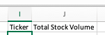

### VBA_Challenge

Sub ABCs()
    Const TICKER_COL As Integer = 1
    Const FIRST_DATA_ROW As Byte = 2
    Const VOLUME_COL As Integer = 7
    
    Dim Ticker As String
    Dim CurrentVol As LongLong
    Dim WS As Worksheet
    Dim LastRow As Long
    Dim TotalVol As LongLong
    Dim InputRow As Longa
    Dim Row As Range
    Dim Col As Range
    
    'LastRow = WS.Range(“A”, Rows.Count).End(xlUp).Row
    LastRow = Cells(Rows.Count, TICKER_COL).End(xlUp).Row
   
   ## Naming Cell Headers
   
  
    
    Range("I1").Value = "Ticker"
    Range("J1").Value = "Total Stock Volume"
    
    
    
    For InputRow = FIRST_DATA_ROW To LastRow
            'First Row of Current Stock
            'If WS.Range("A", InputRow + 1).Value <> WS.Range("A", InputRow).Value Then
            Ticker = WS.Range("A", InputRow).Value
            
                TotalVol = 0
            
            End If
            
            CurrentVol = Cells(InputRow, VOLUME_COL)
            TotalVol = TotalVol + CurrentVol
            
            'Last Row of Current Stock
            If Cells(InputRow + 1, TICKER_COL).Value <> Cells(InputRow, TICKER_COL).Value Then
                'Ticker = Cells(InputRow, TICKER_COL).Value
    
            
            End If
    
    Next InputRow
    
    End Sub
Module 2
